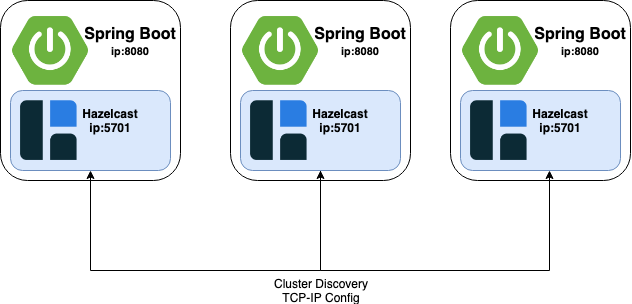

Hazelcast 4 Cluster application designed for projects.

#Hazelcast Cluster application designed for enterprise projects.

Three(3) nodes/members hazelcast cluster



Tech Stack

* Java version: 11
* Hazelcast version: 4.2.2
* Spring Boot version: 2.5.4
* Gradle version: 7.1.1
* Undertow
* Log4j2

#1 - Download openjdk 11

JDK is a pre-requisite for running hazelcast

download jdk 11 from the link. (our installation is for linux operating system distribution)

https://jdk.java.net/java-se-ri/11

https://download.java.net/openjdk/jdk11/ri/openjdk-11+28_linux-x64_bin.tar.gz

    tar -zxvf openjdk-11+28_linux-x64_bin.tar.gz

    mv jdk-11 /app/jdk

#2 - Download hazelcast

download hazelcast 4.2.2 binary distribution from official site.

https://hazelcast.com/open-source-projects/downloads/archives/#hazelcast-platform

https://download.hazelcast.com/download.jsp?version=hazelcast-4.2.2&type=tar&p=

    tar -zxvf hazelcast-4.2.2.tar.gz

    mv hazelcast-4.2.2 hzcluster

#3 Create directories for logs, scripts

create directory for hazelcast server logs

    mkdir /app/hzcluster/logs

create directory for scripts

    mkdir /app/hzcluster/scripts

```bash
#!/usr/bin/env bash
#################################################
# Edit .bashrc and add following line:          #
# alias hz="sh ${MY_SCRIPTS}/hz.sh"             #
#                                               #
# Usage: hz start|stop|log|pid|kill             #
#                                               #
# Code conventions:                             #
# https://google.github.io/styleguide/shell.xml #
#################################################

# Constants
readonly E_DID_NOTHING=1

readonly APP="hzcluster.jar"

readonly JAVA="/app/jdk/bin/java"
readonly JARS="/app/hzcluster"
readonly LOGS="/app/hzcluster/logs"
readonly RAM="-Xms1g -Xmx3g" #hazelcast server memory


readonly CFG_LOCATION="-Dspring.config.location=${JARS}/application.yml" #hazelcast configs via spring application.yamş
readonly PROFILES="-Djava.net.preferIPv4Stack=true"


readonly LOG_FILE="${LOGS}/hzcluster.log"

readonly PID=$(ps -ef | grep java | grep hzcluster | grep -v grep | awk {'print $2'})
readonly COMMAND="$1"

start_hz() {
    if [[ ! -z "${PID}" ]]; then
        printf "${APP} already running\n"
        exit "${E_DID_NOTHING}"
    fi

    printf "Starting ${APP}...\n"

    nohup ${JAVA} ${RAM} -jar ${PROFILES} ${CFG_LOCATION} ${JARS}/${APP} > ${LOG_FILE} 2>&1&
    tail_hz_log
}

stop_hz() {
    if [[ -z "${PID}" ]]; then
        printf "PID not found. ${APP} is not running\n"
    else
        printf "Stopping ${APP} with PID ${PID}\n"
        kill -s TERM "${PID}"
    fi
}

kill_hz() {
    if [[ -z "${PID}" ]]; then
        printf "PID not found. ${APP} is not running\n"
    else
        printf "Killing ${APP} with PID ${PID}\n"
        kill -9 "${PID}"
    fi
}

show_hz_pid() {
        printf "${APP} PID = ${PID}\n"
}

tail_hz_log() {
    tail -f ${LOG_FILE}
}

if [[ -z "${COMMAND}" ]] ; then
        printf "Usage: hz start|stop|log|pid|kill\n"
        exit "${E_DID_NOTHING}"
elif [[ "${COMMAND}" != "start" ]] &&
     [[ "${COMMAND}" != "stop" ]] &&
     [[ "${COMMAND}" != "log" ]] &&
     [[ "${COMMAND}" != "pid" ]] &&
     [[ "${COMMAND}" != "kill" ]]; then
        printf "Invalid command: ${COMMAND}\n"
        printf "Available commands: start, stop, log, pid, kill\n"
        exit "${E_DID_NOTHING}"
else
        printf "Running command ${COMMAND}\n"
fi

if [[ "${COMMAND}" = "start" ]]; then
        start_hz
elif [[ "${COMMAND}" = "stop" ]]; then
        stop_hz
elif [[ "${COMMAND}" = "log" ]]; then
        tail_hz_log
elif [[ "${COMMAND}" = "pid" ]]; then
        show_hz_pid
elif [[ "${COMMAND}" = "kill" ]]; then
        kill_hz
fi

```

#4 Configure hazelcast cluster server properties via spring application.yaml

```yaml
spring:
  application:
    name: app-hzcluster #spring application name
  profiles:
    active: prod #spring application profile

server:
  port: 8080 #spring application web server port

logging:
  config: classpath:log4j2.xml #logging configuration file

hz-cluster:
  cluster-name: app-local #hazelcast cluster name (it is important for client and other members)
  network-config:
    port: 5701
    port-auto-increment: false
    join:
      multicast-config:
        enabled: false
      tcp-ip-config:
        enabled: true
        members:
          - 10.12.61.61 #cluster member ip 1
          - 10.12.61.62 #cluster member ip 2
          - 10.12.61.63 #cluster member ip 3
  cp-subsystem-config:
    cp-member-count: 0 #minimum member of CP subsystem
  properties: |
    hazelcast.health.monitoring.level=NOISY

management:
  endpoints:
    web:
      exposure:
        include: health,loggers

security-configurations:
  bcrypt-password-strength: 11
  users:
    - username: admin
      # Password is: d8a194e0b35f23f6fd5126d60296eb4f
      password: '$2a$11$xrDaYpnpILVS3CEwe2twROxJaF9UImNHHlgQjxpe3CcEF1vqNrvPm'
      authorities:
        - ROLE_READ
        - ROLE_WRITE
```

#8 user .bashrc global variables and shortcut settings

alias of hazelcast scripts

    export HZ_SCRIPTS="/app/hzcluster/scripts"
    alias hz="${HZ_SCRIPTS}/hz.sh hz"

set jdk to path

    export JAVA_HOME=/app/jdk
    export PATH=$PATH:$JAVA_HOME/bin

#9 Define as a system service

    [Unit]
    Description=HzCluster Service
    
    [Service]
    Type=forking
    User=appuser
    ExecStart=/app/hzcluster/scripts/hz-service-start.sh --no-daemon
    Restart=always
    RestartSec=60
    TimeoutStopSec=60
    TimeoutStartSec=60
    
    [Install]
    WantedBy=default.target


#10 start hazelcast application using alias

hz start

    11-10-2021 16:34:04.686 [I|TcpIpConnection] [10.12.61.61]:5701 [prod] [4.2.2] Initialized new cluster connection between /10.12.61.61:56571 and /10.12.61.63:5701
    11-10-2021 16:34:10.692 [I|ClusterService] [10.12.61.61]:5701 [prod] [4.2.2]
    
    Members {size:3, ver:3} [
    Member [10.12.61.62]:5701 - db0da0d1-059f-4962-ab75-13221ac06b8a
    Member [10.12.61.63]:5701 - 4248aecd-3904-45eb-bf3b-93d1138e5edb
    Member [10.12.61.61]:5701 - e6ed4dd6-7994-4ce2-9bb6-d6e335d048ac this
    ]
    
    11-10-2021 16:34:11.706 [I|LifecycleService] [10.12.61.61]:5701 [prod] [4.2.2] [10.12.61.61]:5701 is STARTED

hz pid

    Running command pid
    hzcluster.jar PID = 1630717

hz stop

    Running command stop
    Stopping hzcluster.jar with PID 1630717

#11 Server alarm log error codes

Port check scripts

5701 port is periodically checked.
Memory size is periodically checked.


#12 References

    https://inomera.com
    https://docs.hazelcast.com/home/index.html
    https://hazelcast.com/blog/hazelcast-imdg-3-12-introduces-cp-subsystem
